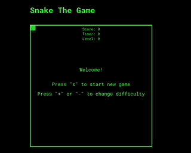

# Snake The Game

The legendary game Snake implemented with TypeScript & React. Build on top of the HTML Canvas Graphics without any additional libaries.

## Features

- Start, pause and game over screen
- HUD with information of your score, the elapsed time and the difficulty level
- 3 level of difficulty (which basically increasing the velocity of the snake)
- Keyboard controls
- Sounds for eaten and game over

## Controls

- "s" start or retry
- "+", "-" change the difficulty
- "p" pause
- "q" going back to start screen

## Future ideas

- Increase difficulty
  - Spawn random obstacles
  - Increase tail length by more than 1
- Technical stuff
  - Design (dark, retro-mode)
  - Maybe using something like a state container (redux)